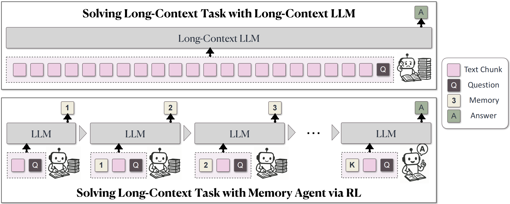
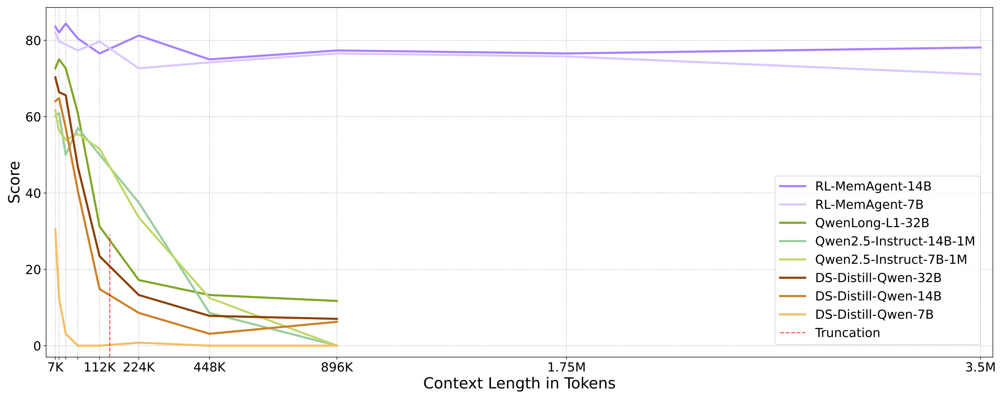
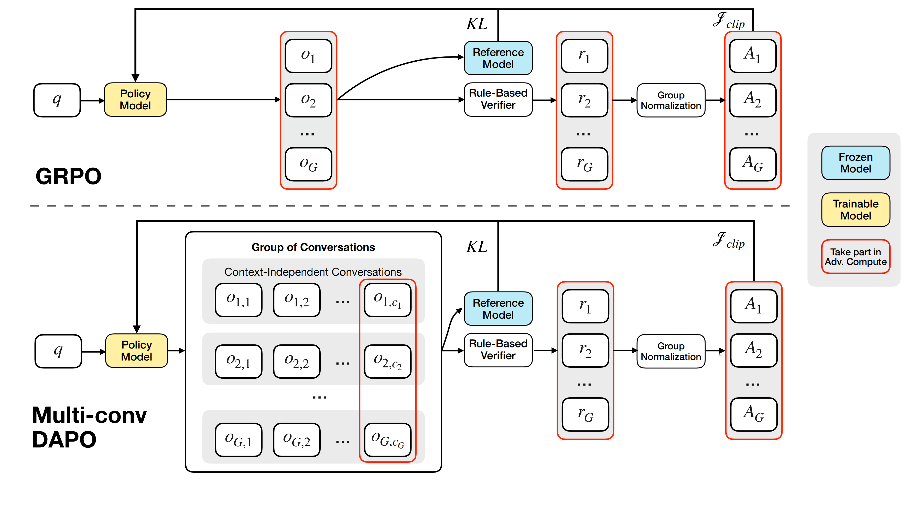
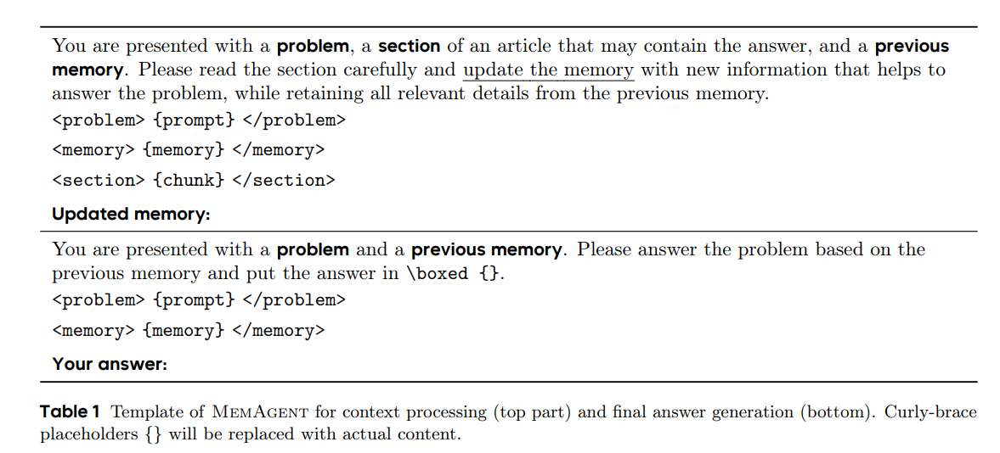
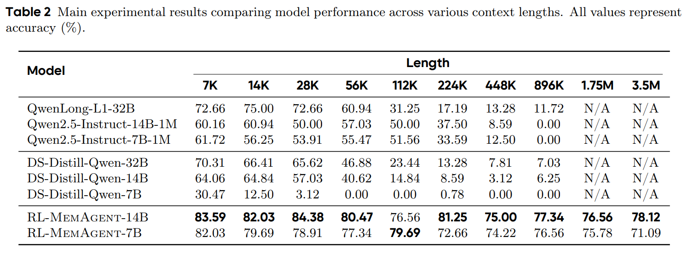
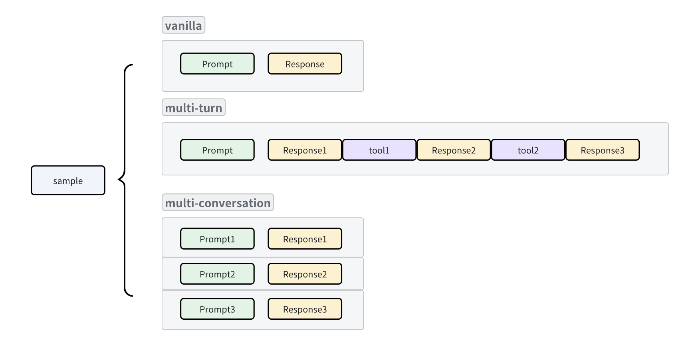

<div style="display: flex; justify-content: space-between;">
    
    
    
</div>
<br>
<div align="center">

<h1 style="display: flex; justify-content: center; align-items: center; gap: 10px; margin: 0;">
  MemAgent: Reshaping Long-Context LLM with Multi-Conv RL based Memory Agent
</h1>

[](https://arxiv.org/abs/2507.02259)
[](https://memagent-sialab.github.io/)
[](https://huggingface.co/datasets/BytedTsinghua-SIA/hotpotqa)
[](https://huggingface.co/BytedTsinghua-SIA/RL-MemoryAgent-14B)
</div>

---

> [!IMPORTANT]
> **🔥 News!!!**
> - **[2025/07]** We provide a **quickstart** script that makes using **MemAgent** super easy, see the **Quickstart** section below.
> - **[2025/06]** We release **RL-MemAgent-14B** and **RL-MemAgent-7B** models achieving nearly lossless performance on 3.5M token contexts task.

---
## 📖Introduction

We propose a novel long-context processing framework — **MemAgent**, which directly optimizes long-context tasks through end-to-end Reinforcement Learning without altering the underlying model architecture. MemAgent has demonstrated superb long-context capabilities, being able to extrapolate from an 8K context trained on 32K text to a 3.5M QA task with performance loss < 5% and achieves 95%+ accuracy in 512K RULER test.

<div align="center">
  
</div>

### Highlights:
- **🚀 Novel memory mechanism** Introduces MemAgent architecture enabling arbitrarily long input processing within fixed context windows, overcoming traditional context window length limitations.
- **⚡ Linear time Complexity** Breaks through computational bottlenecks in long-text processing, achieving linear scaling of resources with text length.
- **🎯 RL-driven extrapolation** Through RL training with MemAgent architecture, enables models to extrapolate to vastly longer texts with minimal performance degradation.
<div align="center">
  
</div>

### Multi-conv RL Framework
We use Reinforcement Learning from Verifiable Rewards (RLVR) to train MemAgent, extending the DAPO algorithm to support end-to-end optimization of Agent Workflows with multi-turn context-independent conversations.

 

### Results

**RL-MemAgent** demonstrates exceptional stability in ultra-long context processing：
- **14B model:** Performance degradation <5.5% on 3.5M token tasks, achieving truly lossless extrapolation.
- **7B model:** Only 11% performance decline in longest contexts, significantly outperforming existing long-context models



## Quickstart

`quickstart.py` offers a straightforward way to begin using MemAgent, supporting both local deployment and integration with online model services.


### vLLM Local Deployment


1.  **Start the `vllm` server:**

    ```bash
    vllm serve BytedTsinghua-SIA/RL-MemoryAgent-14B --tensor_parallel_size 2
    ```

2.  **Run `quickstart.py`:**

    ```bash
    python quickstart.py --model BytedTsinghua-SIA/RL-MemoryAgent-14B
    ```

### Online LLM Service

For online LLM services, you'll need to configure your model endpoint and API key as environment variables.


e.g.  `gpt-4o-2024-11-20`:
- **Normal online services**: Simply use `https://{endpoint}`.
- **Azure OpenAI**: Use the format `https://{endpoint}/openai/deployments/gpt-4o-2024-11-20`.

```bash
export URL=
export API_KEY=
python quickstart.py --model gpt-4o-2024-11-20
```

## Reproducibility

### Performance

In reproduction, you may find that the validation score during training is not equal to the final score (about 50% vs 80%). 
This behavior is expected because during training we actually used a stricter version of the verifier to prevent reward hacking, while during testing we used a more lenient verifier. Specifically

- In the [training verifier](https://github.com/BytedTsinghua-SIA/MemAgent/blob/main/verl/utils/reward_score/hotpotqa.py), the model’s answer must be placed inside `\boxed{}` with exact case matching and no additional characters.

- In the [testing verifier](https://github.com/BytedTsinghua-SIA/MemAgent/blob/main/taskutils/memory_eval/utils/__init__.py), articles like “a/the” are ignored, as are case differences and punctuation.

The stricter training verifier was inherited from earlier math-related RL work, whereas the more relaxed testing verifier aligns with practices in long-context projects such as Ruler and Qwen-Long.


### Testing Results

```bash
pip install httpx==0.23.1 aiohttp -U ray[serve,default] vllm
```

1. Prepare QA data

```bash
cd taskutils/memory_data
bash download_qa_dataset.sh
```

2. Download the dataset

```bash
cd ../..
bash hfd.sh BytedTsinghua-SIA/hotpotqa --dataset --tool aria2c -x 10
export DATAROOT=$(pwd)/hotpotqa
```

3. Preparing models

The model used in tests will be downloaded from HuggingFace. However, Qwen2.5-Instruct series models needs to be downloaded manually and properly config their `config.json` to activate YaRN. Please follow the instruction in [Qwen2.5-Instruct Repo](https://huggingface.co/Qwen/Qwen2.5-7B-Instruct)


```bash
bash hfd.sh Qwen/Qwen2.5-7B-Instruct --model --tool aria2c -x 10
bash hfd.sh Qwen/Qwen2.5-14B-Instruct --model --tool aria2c -x 10
bash hfd.sh Qwen/Qwen2.5-32B-Instruct --model --tool aria2c -x 10
# then change the config.json manually
```

```bash
export MODELROOT=/your/path/to/models # move to your model root directory, this env variable is used in the run.py script
mv Qwen2.5-7B-Instruct $MODELROOT/Qwen2.5-7B-Instruct-128K
mv Qwen2.5-14B-Instruct $MODELROOT/Qwen2.5-14B-Instruct-128K
mv Qwen2.5-32B-Instruct $MODELROOT/Qwen2.5-32B-Instruct-128K
```

4. Running

**Note:** This will take a few days to run all the tests, you may want to specify which tests/models to run.

```bash
cd taskutils/memory_eval
python run.py
```

**Note:** This scripts will use all available GPUs to serve the 
models. If you have multiple GPU nodes, you can create a ray cluster and run the script in one of cluster nodes. Use `SERVE_PORT` and `DASH_PORT` to specify the ports for the ray cluster.

```bash
cd taskutils/memory_eval
SERVE_PORT=8000 DASH_PORT=8265 python run.py # port numbers here are default values, you may need to specify them as the serve/dashboard port in your ray cluster
```


## Training

Fistly specify `PROJ_ROOT` (for checkpoints) and `DATASET_ROOT` (for training data, should be the same as used in testing) in `run_memory_7B.sh` and `run_memory_14B.sh`. 

Then run this script directly to launch a single-node training, or config a ray cluster properly and run the script in one of the cluster nodes.


## Data


Please run the following commnads in this section under the`taskutils/memory_data` directory.

```bash
cd taskutils/memory_data
pip install nltk pyyaml beautifulsoup4 html2text wonderwords tenacity fire
```

1. Train & dev split: hotpotqa_train.parquet & hotpotqa_dev.parquet

- Download qa dataset and synthetic data, skip this step if you have downloaded it in the previous step:

```bash
bash download_qa_dataset.sh
```

```bash
python processing.py # Dataprocess, synthetic long context multihop-QA
```

- Deploy Qwen-7B in localhost:8000 and Qwen-7B-Instruct in localhost:8001

- filtering

```bash
python filter.py -i hotpotqa_dev_process.parquet -o hotpotqa_dev_result --noresume
python filter.py -i hotpotqa_train_process.parquet -o hotpotqa_train_result --noresume
python3 filter2.py # Filtering out sample which can be answered correctly by LLM without any context:
```

### 2. Main task: eval\_{50|100|200|...}.json

```bash
export DATAROOT="your_dir_to_hotpotqa_dev.parquet"
python convert_to_eval.py # Convert the `hotpotqa_dev` to `eval_200.json`
python different_docs_eval.py.py # Create eval dataset with different number of documents
```


### 3. OOD task: eval_{rulersubset}_{8192|16384|...}.json

```bash
export DATAROOT="your_dir_to_hotpotqa_dev.parquet"
python download_paulgraham_essay.py
bash download_qa_dataset.sh
bash ruler_data_prepare.sh 
```

## Engineering

### Sync mode: From tool-calling to general workflow

Inspired by [Search-R1](https://github.com/PeterGriffinJin/Search-R1), we implement a framework for general multi-conversation workflow with indepedent context. Therefore the context is not limited to be a concatenated string of all previous conversations as in original tool-calling. This framework make it possible to optimize a multi-step agent in a end-to-end manner. Memory agent is one of the examples of this framework, demonstrating how the reinforcement learning can be applied to optimize the agent's performance in a multi-step workflow.

See the `recurrent/impls/memory.py` for implementation details and `recurrent/interface.py, recurrent/generation_manager.py` for our interface design.

### Async mode: Agent as a function

Based on [the server mode generation](https://github.com/volcengine/verl/pull/1138), we further implement a brand new framework which **allows users to implement an agent as a function which calling LLMs in openai-api style**, without worrying about batched tensor operation such as tokenization, padding, state tracing, which often requires a lot of boilerplate code or even a state machine.


In this view, each agent is a function that returns one or more list of `{"role":"", "content":""}` dicts:


  - vanilla：`[{"role":"user","content":pmt},{"role":"assistant""content":rsp}]`
  - multi-turn tool-calling：`[{"role":"user","content":pmt},{"role":"assistant","content":rsp1},{"role":"tool","content":obs},{"role":"assistant","content":rsp2}]`,
  - context-indepedent multi-conversation：`[{"role":"user","content":pmt1},{"role":"assistant","content":rsp1}], [{"role":"user","content":pmt2},{"role":"assistant","content":rsp2}]`

We modify the `chat_template` to support tool-response masking without any tensor operations.

See the `rollout` method implementation of agent class defined in `recurrent/impls/async_*.py` for more details and `recurrent/interface.py, recurrent/async_generation_manager.py` for our framework design.


### RayActor Process pool

Computation-intensive reward computation or tool calling may stuck the head node from sending generation requests to LLMs. To promote the efficiency of cpu-intensive tasks, we create a RayActor in each node that runs a process pool and accepts tasks from the head node.

Therefore, the cpu task can be executed asynchronously by submitting to ray actor, so does the gpu task：LLM generation.

See `verl/workers/reward_manager/thread.py` for more details.

## Acknowledgements

We thank [verl](https://github.com/volcengine/verl) team for providing a flexible and powerful infrastructure.

We thank the authors of [the server mode generation](https://github.com/volcengine/verl/pull/1138) for their great work, which provides a solid foundation for our async agent framework.

## Citation

If you find this work useful, please consider citing our paper:

```bibtex
@article{yu2025memagent,
  title={MemAgent: Reshaping Long-Context LLM with Multi-Conv RL-based Memory Agent},
  author={Yu, Hongli and Chen, Tinghong and Feng, Jiangtao and Chen, Jiangjie and Dai, Weinan and Yu, Qiying and Zhang, Ya-Qin and Ma, Wei-Ying and Liu, Jingjing and Wang, Mingxuan and others},
  journal={arXiv preprint arXiv:2507.02259},
  year={2025}
}
```
